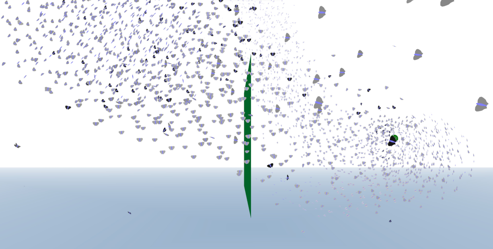

# The Particle System API

*Since 1999, using C++, OpenGL, GLUT, and CMake*

by David McAllister
version 3.0.0
April 18, 2022

Hosted at https://github.com/davemc0/Particle.git.
(Previously hosted for 15 years at: http://www.particlesystems.org.)

Documentation is [here](./ParticleLib/doc/html/index.html).

Change log is [here](./ChangeLog.html).

Future work is [here](./ToDo.html).

Welcome back to the Particle System API!
==================================

The Particle System API has served as a resource for building all sorts of interesting particle system-based special effects, mostly for games and other interactive 3D graphics.
Version 2.2 was used in projects by over 600 developers. I dropped maintenance of the library in 2009 when my life switched to ray tracing, but I didn't effectively host the library publicly, so it largely died out.

I have recently revisited the API and added many enhancements. The most important is the _inline action mode_. The actions are now implemented in inline functions that apply to one particle. The application owns the loop over the particles, allowing a single pass over a particle to perform all actions. Performance is massively faster because of this for three main reasons:
1) The compiler can optimize computations across all the actions on a particle,
2) The particle is only loaded into memory once per time step, and
3) The particle computations are trivially parallelized across cores, and potentially SIMD lanes by using std::for_each with a parallel execution policy on C++17.
Performance is now at around 30 million particle updates per second on my laptop with a moderate CPU. And the inline actions should be usable in CUDA kernels for a major GPU speedup.

A few other notable updates:
* The build system is now based on CMake.
* The project is hosted on GitHub. Your collaboration is invited.
* The sample effects are much more elegant and unified and are frame rate independent by varying dt with frame time.
* There is a good flocking behavior effect, based on Craig Reynolds' Boids.

Building the Program
====================

Building ParticleLib can be accomplished using just this code, CMake, and a C++ compiler.
It has no external dependencies.

However, the examples and demos also depend on DMcTools: https://github.com/davemc0/DMcTools.git

DMcTools has my collection of graphics tools - matrix class, image stuff,
3D vector class, random numbers, timer, 3D model loader, etc.
It is only needed by the PSpray and ParBench demo, not the API or the Example demo.
DMcTools is copyright by me, and maybe others.

To build everything you will also need:

* CMake 3.20 or newer. (You could try an older one, but no guarantees.)
* FreeGLUT. I use 3.2.2.
* GLEW. I use 2.2.0.

I set environment variables for GLUT_HOME and GLEW_HOME on Windows. This shouldn't be necessary on Linux or Mac.

How to build
------------

In the main directory, do something like:

    mkdir build
    cd build
    cmake .. -G "Visual Studio 16 2019" -A x64
    cd ..

Then you can build from the command line:

    cmake --build build/ --config Release

or launch build/ParticleSolution.sln in Visual Studio.

Example Code
============

Example
-------
An OpenGL and GLUT-based example of particle systems used to render a fountain

Playground
----------
Double-click to start the program.

Press 'f' to make it full screen.

Right-click in the window to pop up the menu.
The keyboard shortcuts are listed on the menu.

If you don't touch it, it will randomly go through the demos. This should provide hours of family fun.
If you get bored, press 'space' to cause an explosion.
Press 'm' to make cool motion blur.
Press 's' to sort the particles back-to-front for more correct but slower rendering.
Press 'p' to change what each particle is rendered as.

Benchmark
---------
This one runs all the same demo effects as Playground does,
but it doesn't do any graphics. It doesn't use OpenGL or GLUT.

Final Notes
===========

If the demos don't work for you, I'd be happy to try to help. Please include as much detail as
you can about your system and the nature of the problem.

If you have any questions, code contributions or suggestions use github issues or contact me however.

